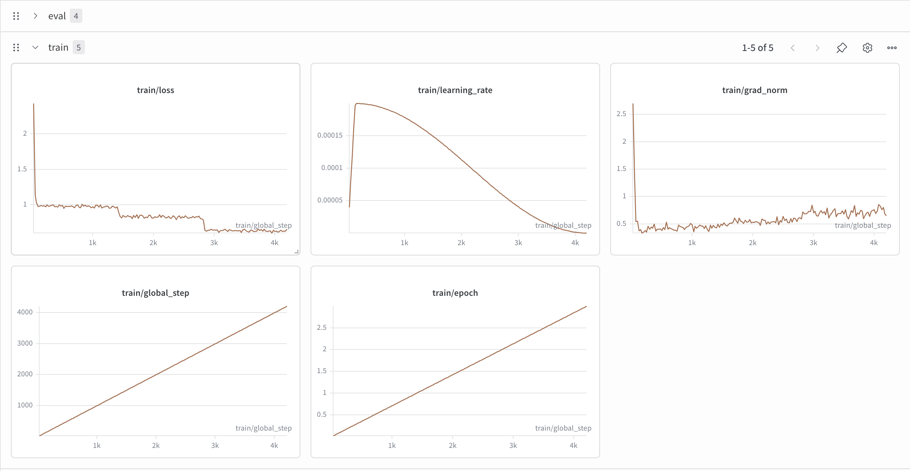

# PyDocLlama: Fine-Tuning Llama 3.1 for Python Documentation

[](https://huggingface.co/datasets/Arinkc/pydoc-llama-codesearchnet-curated)
[](https://huggingface.co/Arinkc/pydoc-llama-r16-full)
[](https://wandb.ai/kcarin123-salisbury-university/pydoc-llama/runs/90x6qcy6)
[](https://python.org)

Fine-tuning Llama 3.1 8B to generate accurate, concise Google-style Python 
docstrings — eliminating hallucinations and enforcing format consistency 
through a complete end-to-end ML pipeline.

---

## The Problem

Python docstrings are inconsistent in the wild. Base LLMs like Llama 3.1 8B 
can generate them, but with three systematic failure modes:

1. **Hallucination** — inventing exception types and parameters that don't 
   exist in the code
2. **Verbosity** — generating walls of text when a one-liner is appropriate
3. **Inconsistency** — mixing Google-style, NumPy-style, and reStructuredText 
   in the same codebase

This project fine-tunes Llama 3.1 8B on curated Google-style docstring data 
to fix all three.

---

## Results

Evaluated on 200 held-out test examples from the curated dataset:

| Metric | Base Model | Fine-Tuned | Change |
|--------|-----------|------------|--------|
| Hallucinated exceptions | 11.0% | **0.0%** | ↓ 11.0% |
| Verbose outputs (>80 words) | 19.5% | **0.0%** | ↓ 19.5% |
| Starts with capital letter | 80.5% | **100.0%** | ↑ 19.5% |
| Clean output (no preamble/fences) | 98.0% | **100.0%** | ↑ 2.0% |

Training loss decreased from **2.3 → 0.63** over 4,212 steps (3 epochs).

### Before vs After

**Example 1: Hallucination elimination**

```python
def cipher(self):
if not self._handshake_done:
return
current_cipher = SSL_get_current_cipher(self._ssl.value)
cipher_name = SSL_CIPHER_get_name(current_cipher)
cipher_version = SSL_CIPHER_get_version(current_cipher)
cipher_bits = SSL_CIPHER_get_bits(current_cipher)
return cipher_name, cipher_version, cipher_bits
| | Output |
|---|---|
| **Base model** | "Returns the current SSL cipher details. Raises: ValueError: If the handshake is not complete." *(ValueError never raised in code)* |
| **Fine-tuned** | "Returns the current cipher suite used in this connection." |
| **Reference** | "Retrieve information about the current cipher" |

**Example 2: Correct structured output**

```python
def Items(self, key):
with self._mutex:
if key not in self._buckets:
raise KeyError('Key %s was not found in Reservoir' % key)
bucket = self._buckets[key]
return bucket.Items()
| | Output |
|---|---|
| **Base model** | "Returns the items in the bucket. Note: This function is thread-safe due to the use of `_mutex`." *(vague, no Args/Raises)* |
| **Fine-tuned** | "Returns a list of all items in the Reservoir associated with the specified key. Args: key: The key to retrieve items for. Returns: A list of items. Raises: KeyError: If the specified key is not in the Reservoir." |
| **Reference** | "Return items associated with given key. Args: key: ... Raises: KeyError: ..." |

---

## Training Dynamics



Loss decreased from ~2.3 to ~0.63 over 4,212 optimizer steps across 3 epochs.
Notable phases:
- **Steps 0–200 (warmup):** Learning rate ramps up, loss drops steeply from 2.3 → ~1.0
- **Steps 200–2800 (main training):** Steady improvement, validation loss tracks training loss
- **Steps 2800–4212 (epoch 3):** Training loss continues to ~0.63; mild overfitting 
  observed (val loss plateaus at ~0.95). Best generalization checkpoint at step ~2800.

---

## Architecture
CodeSearchNet (450K examples)
↓ Multi-stage filter (30.66% pass rate)
126K curated examples
↓ Random sample (seed=42)
25K Google-style docstring pairs
↓ AST-based docstring stripping + chat formatting
24,970 training examples
↓ Train/val/test split (90/5/5)
↓
QLoRA Fine-tuning
├── Base: Llama 3.1 8B Instruct
├── Quantization: 4-bit NF4 + double quantization
├── LoRA: rank=16, alpha=32, dropout=0.05
├── Target modules: q/k/v/o projections + gate/up/down
├── Optimizer: AdamW
├── LR: 2e-4 with cosine decay + 3% warmup
├── Epochs: 3, Effective batch: 16
└── Hardware: NVIDIA A100-SXM4-40GB (4h 51m)
↓
Evaluation
├── 200 held-out examples
├── Format compliance metrics
├── Hallucination detection
└── Side-by-side comparison

---

## Dataset

**Source:** [CodeSearchNet](https://huggingface.co/datasets/code-search-net/code_search_net) 
Python subset (412,178 raw examples)

**Published dataset:** [Arinkc/pydoc-llama-codesearchnet-curated](https://huggingface.co/datasets/Arinkc/pydoc-llama-codesearchnet-curated)

### Curation Pipeline

The dataset is filtered to Google-style docstrings only. The filter applies:

- **Length bounds:** Code 100–2000 chars, docstring 30–500 chars
- **Style rejection:** Explicitly rejects reStructuredText (`:param:`, `:return:`), 
  JavaDoc (`@param`), and NumPy (`Parameters\n---`) styles
- **Quality signals:** Requires capital-letter start, minimum word count, 
  <5% non-ASCII content, no TODO/FIXME markers
- **Style acceptance:** Accepts Google sections (`Args:`, `Returns:`, `Raises:`) 
  OR clean prose one-liners (≤4 lines, <400 chars)

**Filter calibrated on a 1,000-example sample through three iterations:**

| Iteration | Pass Rate | Change |
|-----------|-----------|--------|
| Length + quality only | 60.3% | Baseline |
| + Google-style enforcement | 26.5% | Too strict (false negatives on prose) |
| + Loosened prose acceptance | 35.5% | Final |

**Final dataset:** 24,970 examples after AST-based docstring stripping 
and token-length filtering.

| Split | Examples |
|-------|----------|
| Train | 22,473 |
| Validation | 1,248 |
| Test | 1,249 |

### Critical Data Engineering Decision

`func_code_string` in CodeSearchNet includes the docstring inline. Training 
on this directly would create a degenerate task where the model learns to 
copy text from input to output. I used Python's `ast` module to detect and 
strip the docstring from the function body before formatting training examples.

0.12% of examples (30/25,000) had docstrings placed mid-function rather 
than as the first statement — not real docstrings under PEP 257's definition. 
These were filtered out via a `(stripped_code, success: bool)` return pattern 
to prevent leakage.

---

## Repository Structure
llm-finetuning-project/
├── src/
│   ├── train.py              # QLoRA training script with SFTTrainer
│   ├── data_filter.py        # Multi-stage docstring quality filter
│   └── cuda_setup.py         # CUDA 13 library preloader (Kaggle env)
├── notebooks/
│   ├── 00-environment-check.ipynb   # GPU verification and baseline
│   ├── 01_explore_data.ipynb        # CodeSearchNet exploration
│   ├── 02-prepare-data.ipynb        # Dataset curation and formatting
│   ├── 03_train_model.ipynb         # Training on Kaggle/Colab
│   └── 04_evaluate.ipynb            # Evaluation and analysis
├── evaluation/
│   ├── baseline_output.json         # Base model outputs (pre-training)
│   ├── evaluation_report.json       # Full evaluation metrics
│   ├── best_examples.json           # Selected before/after examples
│   └── data_length_distribution.png # Dataset length analysis chart
├── demo/
│   └── app.py                       # Gradio demo (requires GPU inference)
├── configs/
│   └── requirements_locked.txt      # Pinned dependency versions
└── README.md

---

## Reproducing This Project

### Requirements

```bash
pip install -r requirements.txt
```

### Training

```python
from src.train import TrainingConfig, run_training

# Full training run (requires A100 or similar)
cfg = TrainingConfig(smoke_test=False)
trainer = run_training(cfg)

# Smoke test (verifies pipeline, 6 steps)
cfg = TrainingConfig(smoke_test=True)
trainer = run_training(cfg)
```

Set these environment variables before running:
```bash
export HF_TOKEN=your_huggingface_token
export WANDB_API_KEY=your_wandb_key
```

### Inference

```python
from transformers import AutoModelForCausalLM, AutoTokenizer, BitsAndBytesConfig
from peft import PeftModel
import torch

BASE = "meta-llama/Llama-3.1-8B-Instruct"
ADAPTER = "Arinkc/pydoc-llama-r16-full"

bnb = BitsAndBytesConfig(load_in_4bit=True, bnb_4bit_quant_type="nf4",
                          bnb_4bit_compute_dtype=torch.bfloat16)

tokenizer = AutoTokenizer.from_pretrained(BASE)
model = PeftModel.from_pretrained(
    AutoModelForCausalLM.from_pretrained(BASE, quantization_config=bnb, device_map="auto"),
    ADAPTER,
)
model.eval()

def generate_docstring(code: str) -> str:
    messages = [
        {"role": "system", "content": "You are an expert Python documentation writer. Generate a concise Google-style docstring. Output only the docstring text."},
        {"role": "user", "content": f"Document this function:\n\n```python\n{code}\n```"},
    ]
    inputs = tokenizer.apply_chat_template(messages, add_generation_prompt=True, return_tensors="pt").to("cuda")
    with torch.no_grad():
        out = model.generate(inputs, max_new_tokens=200, do_sample=False, pad_token_id=tokenizer.eos_token_id)
    return tokenizer.decode(out[0][inputs.shape[1]:], skip_special_tokens=True).strip()
```

---

## Key Engineering Decisions

**Why QLoRA over full fine-tuning?**
An 8B model in FP16 requires ~80GB VRAM for full fine-tuning. QLoRA reduces 
this to ~12GB by combining 4-bit quantization with low-rank adapters, enabling 
training on a single A100.

**Why Google-style only?**
CodeSearchNet contains 5+ competing docstring styles. Training on mixed styles 
produces a model that generates inconsistently. Filtering to one style makes 
the before/after comparison clean and measurable.

**Why LoRA rank 16?**
Rank 16 (0.9% trainable parameters) is a standard starting point for 
instruction-following tasks on instruction-tuned base models. Higher ranks 
offer diminishing returns for style adaptation since the base model already 
understands docstrings — fine-tuning steers, not teaches from scratch.

**What didn't work perfectly**
The fine-tuned model produces one-liners for ~79% of outputs, reflecting 
the training distribution (35.5% of training examples were clean one-liners). 
For complex functions, it correctly adds Args/Returns/Raises sections (Example 2 
above). Future work: train on a dataset with a higher proportion of 
fully-structured examples to push the structured output rate higher.

---

## Artifacts

| Artifact | Link |
|----------|------|
| Training dataset | [Arinkc/pydoc-llama-codesearchnet-curated](https://huggingface.co/datasets/Arinkc/pydoc-llama-codesearchnet-curated) |
| LoRA adapter | [Arinkc/pydoc-llama-r16-full](https://huggingface.co/Arinkc/pydoc-llama-r16-full) |
| Merged model | [Arinkc/pydoc-llama-r16-merged](https://huggingface.co/Arinkc/pydoc-llama-r16-merged) |
| Training run | [W&B: full-run-r16-lr0.0002](https://wandb.ai/kcarin123-salisbury-university/pydoc-llama/runs/90x6qcy6) |
| GitHub | [arinkc/llm-finetuning-project](https://github.com/arinkc/llm-finetuning-project) |

---

## Known Limitations

- **One-liner bias:** 79% one-liner rate reflects training distribution; 
  not a regression but a learned pattern that could be adjusted with 
  different training data composition.
- **Mild overfitting at epoch 3:** Validation loss plateaus at ~0.95 while 
  training loss reaches 0.63. Best generalization at step ~2800.
- **Domain specificity:** Trained on open-source Python from GitHub 
  (CodeSearchNet). May not generalize to highly domain-specific codebases 
  (scientific computing, embedded systems, etc.).
- **Base model dependency:** Requires Llama 3.1 8B Instruct access 
  (gated model on HF Hub).

---

## Future Work

- **LLM-as-judge evaluation** with GPT-4 for pairwise comparison
- **Higher structured-output rate** via training data rebalancing  
- **vLLM deployment** for production serving with PagedAttention
- **Ablation study** on LoRA rank (8, 16, 32, 64)
- **Multi-style support** (user-selectable Google/NumPy/RST output)

---

## Stack

Python · PyTorch · Hugging Face Transformers · PEFT · TRL · bitsandbytes · 
Accelerate · Datasets · Weights & Biases · Gradio

---

*Built as a portfolio project demonstrating end-to-end LLM fine-tuning 
for a CS undergraduate with concentration in AI.*
